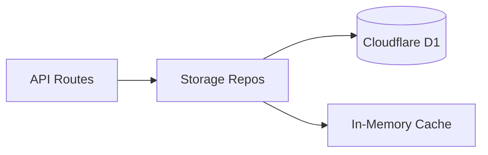
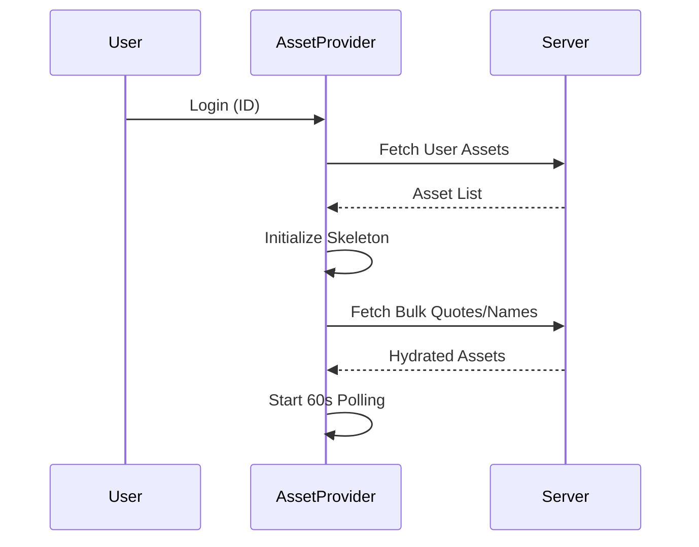

# Stock Tracker 架构文档 (v2.0)

本项目已完成从“单体存储/杂乱逻辑”到“领域驱动存储 (Repos) + 集中式调度 (Orchestrator)”的整改。

## 1. 后端架构：领域存储层 (lib/storage/*)

我们将原先 500+ 行的 `lib/storage.js` 拆分为职责明确的 Repository 模式：


- **quoteRepo.js**: 实时行情专用仓库，优先使用内存缓存。
- **historyRepo.js**: 历史 K 线数据存储，支持批量写入优化。
- **intradayRepo.js**: 分时图数据管理，具备市场收盘后的过期保护。
- **nameRepo.js**: 资产名称映射表，管理 `names:all` 核心键值。
- **logRepo.js**: 系统日志采集与查询。
- **maintenanceRepo.js**: 运维专用，负责僵尸资产清理与过期数据脱靶。

### 数据流图 (Backend)


## 2. 前端架构：集中式调度器 (Orchestrator)

通过 `AssetProvider` 实现状态机管理，解决了 Props Drilling 与 Side-effect 竞态问题：

- **AssetProvider**: 统领 Auth (Session) -> Sync (Assets) -> Polling (Quotes) 的时序。
- **useAsset Hook**: 业务组件交互的唯一入口。
- **BroadcastChannel**: 跨标签页状态自动同步。

### 状态机时序


## 3. API 数据协议 (Envelopes)

所有后端返回均遵循统一包络协议，确保前端 `apiClient` 能够一致处理错误：

```json
{
  "success": true,
  "data": { ... },
  "error": null,
  "code": "SUCCESS"
}
```

## 4. 目录规范

- **app/**: Next.js 页面与 API 路由。
- **lib/storage/**: 存储领域模型。
- **services/**: 前端 BFF 服务层。
- **hooks/**: 基础原子 Hooks。
- **providers/**: 顶层调度 Provider。
- **scripts/**: 运维与集成测试脚本。
- **tmp/**: 临时日志与原始数据。
